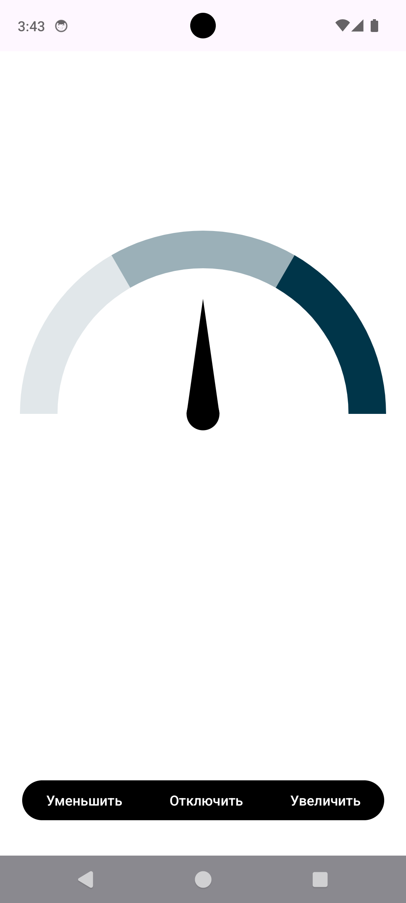
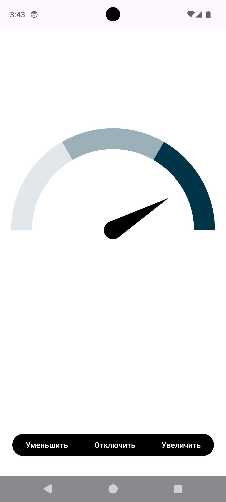
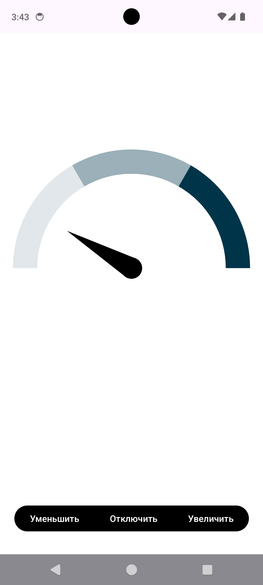
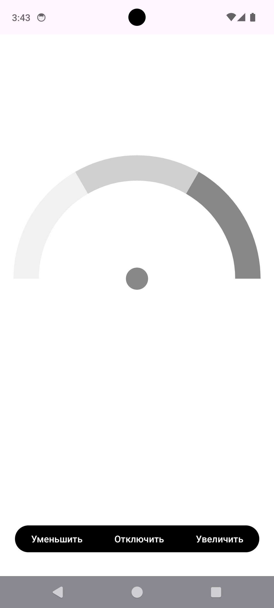

# CustomView
### Учебный проект в рамках курса "Разработка мобильных приложений" Высшая-IT Школа.
В проекте необходимо было реализовать элемент с помощью `CustomView` 

### Функционал:
- При нажатии на кнопку "Увеличить" увеличивается значение счетчика
- При нажатии на кнопку "Уменьшить" уменьшается значение счетчика
- При нажатии на кнопку "Отключить" значение счетчика сбрасывается, при повторном нажатии счетчик опять включается

### Реализовано:

